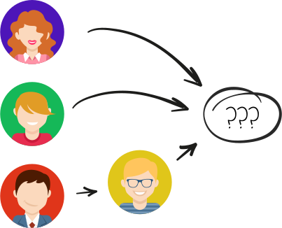
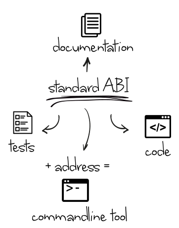

## 1. Abstract
> Imagine if you could not only vote for reddit posts, but govern the entire platform with your interactions.

With the emergence of decentral organizations such as Bitcoin, Ethereum or Applications written on top of Ethereum new forms of governance are needed to direct and evolve this organizations. Such schemas need to be transparent, fair (influence is directly proportional to the ownership), accessible (easy to interact with), extendable, proposed candidates have to be previewable, and verifiable and decissions have to be automatically enforcible. Currently this is still an unsolved problem. In this paper, we analyze the problem space and propose a schema which could serve as a building block in the roadmap to a full self-governance solution.


In the presented method, governance is understood as the task for a group of **actors** (**organization**) with a clear **ownership** distribution to deterministically find a **consensus** out of a set of possible
**candidates**.

Efficient governance tries to optimize the amount of necessary interaction done by each actor to arrive at his desired and reachable state.

The main idea is the tightly coupled relationship of user interactions such as voting and delegations statements with a meta data structure.

The paper is structured in the following way: first we introduce the problem space and a general model for governance in 2. Based on this we introduce an extended model in 3. and discuss the role of data structures for governance, in particular those, which can be described with a regular grammar. In section 4 we present our current proof of concept implementation. In 5. an real world use case is given which illustrates the key value proposition of the presended model. In 4. we present the roadmap for further iterations.
## 2 general model

#### 2.1 organization

Suppose there is organization $O$ with is owned by Alice, Bob, Charlie and Dave
who have agreed to find a name for it. This problem is kind of trivial, but we
want to study it in depth to lay out the mathematical foundations behind it.

<center>  </center>

Every person, who has impact on this decision is member of a set of **owners**
mathematically represented as a set $A$:

$$A = \lbrace Alice, Bob, Charlie, Dave \rbrace$$

The influence of each Member on this decision don't has to be equal. Suppose
there are 100 shares in total. The ownership of **shares** represents
the influence each owner has on the outcome. We can define a share function
which assigns each owner the number of shares he own.

$$share: A \rightarrow \mathbb{N}$$

The sum of all shares is called the **size** of this organization:
$$|O|: = \sum_{a \in A} share(a)$$

In our example Alice has 40 shares which represents 40%, Bob 30, Charlie 20 and Dave 10.

<div id="chart1"></div>

Now everybody can propose a name:

<center>  </center>

We can call all proposals - **candidates**. Our final candidate set looks like the following:
<center class="oneline">
$K=\lbrace "Awesomecorp", "omg\, systems",$  $\rbrace$
</center>


Now every owner can rate each candidate:

|           | Awesomecorp   | omg systems   | 
----------- | ------------- | ------------- | ------------
|  Alice    | 1             | 0.4           | 0
|  Bob      | 0             | 1             | 0
|  Charlie  | 0             | 0             | 1
|  Dave     | 1             | 1             | 1


The evaluation of the candidates by the owners can be represented by a **vote** function:
$$vote: A\times K \rightarrow [0,1]$$

The organization now contains all information we need, to determine the actual winner:

We define an organization state as a tuple:
$$O:=(A,K,<,share,vote)$$
#### 2.2 consensus
We can calculate the actual outcome by considering the votes for each candidate
together with the shares of each voter:

<div id="chart"></div>

The winner candidate is "omg systems" with 2 shares ahead of "Awesomecorp".

Note here that its possible for two candidates to receive the same maximal value.
(For example if charlie had voted 0.1 with 20 shares which would put "Awesomecorp" to 52 shares total.)
In this case we need a system to decide which candidate actually has won: Since
"Awesomecorp" was proposed before "omg systems", we simply will take the oldest candidate with the maximum value:
Mathematically speaking we need a strict total order over the candidates:

$$<\subset K\times K$$

This approach gives us a **consensus** function, which is deterministic on every organization state:

$$consens(O):= min_<(\lbrace k\ |\ value(k) = \max_{k'\in K}(value(k'))\rbrace )$$
$$value(k):=\sum_{a\in A} share(a)*vote(a,k)$$

### delegations

In order to make voting more efficient we can bring in the concept of transitive voting (or delegation).
Suppose in our scenario Dave don't really have the time to evaluate all candidates in this difficult decisions. He also trusts his fried Bob to represent his interest, so he decides to delegate his vote to Bob. Now, every time bob votes or delegates, Daves votes will be taken in to account.

<center>  </center>

Mathematically we define a delegation set:
$$D \subseteq A\times A$$

And in our example Dave is delegating to Bob:
$$D=\lbrace  (Dave, Bob) \rbrace $$


When we look again at our vote matrix, the result would look like this:

|           | Awesomecorp   | omg systems   | 
----------- | ------------- | ------------- | ------------
|  Alice    | 1             | 0.4           | 0
|  Bob      | **0**         | **1**         | **0**
|  Charlie  | 0             | 0             | 1
|  Dave     | **0**         | **1**         | **0**

In this example his delegation actually didn't change the outcome but did had an effect
on the overall rating of the candidates: Awesomecorp is rated with 40 shares and
omg systems with 56 and  with 20.
## 3 extended model

### 3.1 types

Did you notice what happened with Daves proposal? Didn't the organization initially agree to
decide on a name? And  clearly isn't one.
This can be solved by a **type** system: An organization can be restricted to an underlaying structure: 
a set of types it will accepts as valid candidates denoted as $\mathcal{L}$.

A type of an element can be denoted with the colon notation. For example
$"cat\,corp": String$ states, that the candidate "cat corp" has the type String. Similarly we can say  $: Image$.


In our example Dave couldn't have proposed  if the organization had the set of types or "**language**" $\mathcal{L}_1=\lbrace String \rbrace$. However, it would be a valid candidate with the language $\mathcal{L}_2=\lbrace String, Image\rbrace$. The proposed candidate has to satisfy just one of the **alternatives** in the set in order to be valid.
Another notation form for alternatives is $\mathcal{L}_2=(String | Image)$. For a language $\mathcal{L}$ we also adopt the colon notation to state that a candidate matches *one* of the types in the typeset: $"cat\,corp":\mathcal{L}_2$ is valid.

If an organization would want to find a match composed out of a name and a logo, they could have chosen the language $\mathcal{L}_3=\lbrace (String, Image) \rbrace$. A valid candidate must to contain a String and an Image:

e.g. $("catcorp",$  $):\mathcal{L}_3$ would be a valid.

`;

md_222 =`
Note here that the type $(String, Image)$ is a **composition** out of the type $String$ and the type $Image$, so composing types is a valid operation to produce another type. We can write composition with the dot notation: $String\cdot Image$.

Also we want to allow the star operator for a language description:
$\mathcal{L}_4 = String*$ states that the type $String$ can be composed arbitrary times:
$\mathcal{L}_4=\lbrace (), (String), (String, String), (String, String, String), ... \rbrace$

e.g. $("so", "much", "feature"):\mathcal{L}_4$ is valid.

We can now use the operations (alternative, composition, star) to describe a complex structure of our organization!

An example for a complex language is $\mathcal{L}_5=(String, ( Image | String* ) )=$"WIP Name + Logo":

"Either a name and logo-sketch, or a name and a list of requirements for the logo"

Which can be understood as the language:

$\mathcal{L}_5=\lbrace (String, Image), (String), (String,String), (String, String, Sting), ... \rbrace$

So the statement: $("Catcorp", "Black\, and\, White\, Image"): \mathcal{L}_5$ is valid.
### 3.2 regular grammar
In theoretical computer science a description schema to produce a language is a grammar, in our case a regular grammar.

A regular grammar is a composition out of the rules: concatenation, alternative and Kleene.
Formally it is:
* set of terminals $T$ (types: e.g. String, Image, Boolean, Number, ...)
* set of nonterminals $N$ (Contexts - such as \"UI\", \"NameContext\", etc. )
* start rule $S$, which has to be a Nonterminal (e.g. \"Start\")
* set of production rules in one of the following forms: $P \rightarrow t P'$, $P \rightarrow t$ or $P \rightarrow \varepsilon$ ($\varepsilon$ is the empty production)

The \"WIP Name + Logo\" language looks like following in a grammar description $G$:

<p class="eq">
  $T = \lbrace String, Image \rbrace$
  $N = \lbrace Start, ImageCtx, ImageDescriptionCtx \rbrace$
  $S = Start$
  $P = \lbrace$
  $  Start \rightarrow String \cdot ImageCtx, $
  $  Start \rightarrow String\cdot ImageDescriptionCtx, $
  $  ImageCtx \rightarrow Image, $
  $  ImageDescriptionCtx \rightarrow String \cdot ImageDescriptionCtx, $
  $  ImageDescriptionCtx \rightarrow \varepsilon $
  $ \rbrace$
</p>

The grammar is a way to describe the language, by starting with the Start rule and following the production rules untill the end. With this one can proof or disproof the validity of a candidate.

For example the type: $(String\cdot String)$ can be prooven via:

<p class="eq">
  $Start$ 

  $\rightarrow String\cdot ImageDescriptionCtx $

  $\rightarrow String\cdot String\cdot ImageDescriptionCtx $

  $\rightarrow String\cdot String $
</p>

This is also a **proof** for the candidate: $"Catcorp" \cdot "Black\, and\, White\, Image"$.

We can restrict an organization to a grammar: $O_G$ which will handle the candidate validation.
### 3.3 context
The nonterminals of a grammar can also be interpreted as a named context. This is handy for context based statements such as **contextual delegations**.

Imagine in our organization in the "WIP Name + Logo" language Alice is aware about her terrible decision making for Logos. Here she can delegate her votes only in the context of ImageCtx to Charlie. Anyone still can make proposals, but Dave has a voting weight in the context of ImageCtx of 50%. In another context (like ImageDescriptionCtx) he still only has his initial voting weight of 10%.

Also imagine that Bob thinks that at the current status, images should't be considered at all. He also likes the name "OMG Systems" so he votes 0.8 for the $"OMG\, Systems"\cdot ImageDescriptionCtx$. With this statement all candidates which can be derived out of this context by using the production of the organization will receive his vote. Note that also future coming candidates automatically receives his vote! This is called **contextual voting**.


Lets see how our voting table looks

|           | ("OMG Systems")  | ("cat corp", "Black and White Image")   | ("cat corp" ,)
----------- | ---------------- | --------------------------------------- | ------------
|  Alice    | 0                | 1                                       | 0
|  Bob      | 0.8              | 0.8                                     | 0
|  Charlie  | 1                | 0                                       | 1
|  Dave     | 0                | 0                                       | 1
| **total** | $0.8*30+1*20=44$ |  $1 * 40 + 0.8 * 30 = 62$               | $1 * (10 + 40) + 20 = 70$


Our consensus candidate is therefore the last candidate.
### 3.4 evolutions

In the previous examples the organization started with the Grammar "Name" and **evolved** into an organization of the type "WIP Name + Logo". It made this transition by changing the grammar and by porting *some* of the candidates and possibly making other adjustments.

We can define an Evolution formally by a mapping from one organizational state to another:
$$evolution := O_{G_1} \rightarrow O_{G_2}$$

This takes a grammar which the organization is defined in ($G_1$) and maps or filters all of its candidates to candidates which are valid in the grammar $G_2$. It can also make other changes like minting new shares and giving them to the actor, who proposed the winning candidate or change votes and delegations. After the change, it takes the new grammar $G_2$ as its new foundation.

Evolutions are a powerful tool and therefore are only applied when their votes hit a $\frac{2}{3}$ majority.

The set of all defined grammars and evolution-schemas can be seen as a global knowledge base and a path from the current grammar representation to a desired as a "blueprint" or a "recipe" to arrive at the desired goal by following a step by step guide.

<center>  </center>

### 3.5 Interpretations

Interpretations are basically anything, which refers to a consensus of an organization in a **fixed** specific grammar. The interpretation generate a domain specific output based on the consensus candidate and the underlaying language of the linked organization.

For example a candidate with the "Name" lananguage can be displayed in as a webpage header. The webpage would display "OMG Systems", but this could change if the consensus becomes "cat corp" whithout ever changing the website. An interpretation also brings in an easy way to view the underlaying datastructure and therefore preview all proposed candidates before have to vote on them.

An organization can also state its preferred representation: $("LandingPageData"\cdot "Theme")$ is a valid type, where "LandigpageData" represents the type which describes all data of a landingpage such as name, description, logo image etc. and "Theme" is a representation pointer.
## 4. Implementation

### 4.1 data structures
To save space due to the linear structure of regular grammars, we can save all
valid candidates, contextual votes and delevations in a prefix tree:
<center>  </center>

The tree is a compact representation, holding all nessecery information.

Votes and delegations are inhereted to a "leaf" node where the transitive hull of delegations is computed.
Its acting on the vote matrix complements the vote matrix ("add the delegated votes to the vote matrix for each actor which hasn't voted for himself").
Now the known consensus function is used to compute the consensus candidate out of the leaf nodes.


### 4.2 architecture

The main part of an organisation is a contract on the ethereum blockchain described in 3.2.1. Users interact
with the contract either through a command line interface or a graphical user interface described in 3.2.2.

### 4.2.1 On chain
The current solidity contract can be found on [github.com](https://github.com/mhhf/mem/blob/develop/src/contracts/sol/org.sol). The code is under active development and in an experimental stage.


<center>  </center>

The core part of an organization is implemented on the Ethereum blockchain. A user can
iteract with it by either:
* **createOrg** creating a new organization
* **send**: sending shares from the own account to another actor
* **propose**: propose a new candidate
* **vote**: vote for an existing candidate
* **delegate**: delegate his votes to another actor in a particular context
* **getConsens**: ask for the current consens
* **voteEvolution**: vote on a evolution step for the organization

##### 4.2.1.1 createOrg
this creates a new organization

parameters:
* bytes language: is a regular grammer
* uint shares: initial size of the organization

#### 4.2.1.2 send

sends shares from the own account to a given actor.

parameters:
* address to: the address of the actor who should receive the shares
* uint value: the amount of shares to send

#### 4.2.1.3 propose

propose a new candidate

parameters:
* bytes data: serialized candidate data and context description
* bytes type: serialized type description

#### 4.2.1.4 vote

votes for a node in a prefix trie

parameters:
* bytes32 nodeId: the id of the node
* uint value: the rating of the node (0 - 1000)

#### 4.2.1.5 delegate

delegates the vote to another actor for a given context

parameters:
* address to: the address of the delegate
* bytes32 nodeId: the context - a node in the prefix trie

#### 4.2.1.6 getConsens

returns a leaf node id which can be used to resolve the actual type and data of the consens candidate

#### 4.2.1.7 voteEvolution

vote for an evolution for this organization, if its not proposed, propose it first

parameters:
* bytes32 evolutionId: the id of the evolution
* uint value: the rating of the evolution (0 - 1000)


### 4.2.2 Off chain

Currently the off chain implementation is under active development and not in a working stage.
The current experimental implementation can be found [here](https://github.com/mhhf/mem/tree/develop).

#### 4.2.2.1 CLI - command line interface

Here we show an example interaction with the contract over a command line interface for the example shown in section 2.1:

First the organization itself has to be created by one of the owners.
Alice could do something like this:
```sh
> mem new startup --share 10000 --lang=short_simple_name
```

this creates an organzation with a temporary reference *startup*, alice 
receives an initial amount of *10000* shares and the language of this org is
*short_simple_name* which is a reference to another org which decides on what a name should be,
lets see what they've decided upon:
```sh
> mem get short_simple_name
{ type: 'string', pattern: '^[a-z ]{3,32}$' }
```
Here it is a string between 3 and 32 characters which contains letters from a-z and a blank character.

After the org is created alice wants to add its other owners, by transferring them
their initial shares:

```sh
> mem send startup <bob> 3000
> mem send startup <charlie> 2000
> mem send startup <dave> 1000
```

Note that *< bob >, < charlie >, < dave >* are references for addresses of the actors.

This creates our initial ownership distribution.

Now every owner is able to do proposals as long as they are valid words of the language.

**proposals**

Alice propose *Awesomecorp*:
```sh
> mem propose startup -s "Awesomecorp"
```

Bob proposes *omg systems*:
```sh
> mem propose startup -s "omg systems"
```

And Dave tries to propose <cat.png> but fails because it is rejected by the language.
```sh
> mem propose startup ./cat.png
```

**voting**

Now everybody votes( this shows only the case of Alice ):

```sh
> mem vote startup "Awesomecorp" 1
> mem vote startup "omg systems" 0.3
```

**consensus**

Great. now after everybody voted on the candidates, we can see what the consensus
of the decision was:

```sh
> mem get startup
OMG systems
```

**evolution**

Now the organisation want to evolve: Fist we search for possible next evolution steps.
Then we see which evolution is already proposed:
```sh
> mem evolution next startup
  name_to_wip_name_and_logo     - Helps you to find a logo for your organisation, keeps only the consensus name
  name_to_simple_landing_page   - A simple landing page provided do display provided features, keeps all names
  business_model_canvas - Helps you to find a business model for your organisation, removes all names

> mem evolution get startup
  name_to_wip_name_and_logo - 60%
```

Great, we want to find a logo next. Therefore we also vote for the evolution wip_name_and_logo

```sh
> mem evolution vote startup name_to_wip_name_and_logo 1000
```

This will trigger evolution as the new votes hit > 66% and the new grammar of startup becomes wip_name_and_logo with a single candidate - "OMG systems"

#### 4.2.2.1 GUI - graphical user interface

The GUI is not implemented yet, but its major components already defined. Here we will give an overview over them:

Requirements for an first abstraction layer:
1. easy creation of languages
2. propose candidates
3. list, view, preview a candidate
4. vote for a candidate
5. delegate votes
6. send shares
7. view the current consensus candidate
8. vote for evolutions
9. easy creation of evolutions

For the creation of a regular languages first we will take a subset of [JSON-schema](json-schema.org).
JSON-schema is an easy readable and established standard for json type definition. A subset of Json-schemas, namely those which don't contain recursive references, can be taken to produce a regular grammars. We will take this subset to produce arbitrary languages for organizations.

Json Schemas are mainly used to validate json objects and to generate forms to view and manipulate valid objects. Therefore Json-Schemas are a great tool to use to satisfy the requirements 1, 2, 3, 4, 5, 7.
To achieve even more simplicity for writing json schemas a form builder can be introduced such as [this](https://github.com/Kinto/formbuilder) or one of many others.
In section 7. is a demo of a Json-Schema, which produces an editable form and a regular grammar.
For the tasks 6. and 8. custom GUI elements will be engineered.
Evolution schemas (9.) will be created as solidity contracts, since they require complex operations, such as mapping and filtering the candidates and manipulating votes and delegations.
## 5 Example
A real world example is the recent [discussion about a standard coin contract interface](https://github.com/ethereum/EIPs/issues/20). The discussion was held on different platforms in an unstructured way and therefore it took a long time for the community to form a consensus. Now other contract interface standardization discussions are held for verity other domains following the same unstructured process. The following is an example how a interface standardization could be implemented on top of the presented model.


An organization can be formed around a specific api standardization task, in our case the coin/ tokens. They pick a grammar, which describes the application binary interface and the natspec documentation of every interface point.
The language could looks like this:

```sh
standardABI:=(Interface Natspec)*
Interface:= FunctionName FunctionParameter* ReturnParameter*
FunctionName := string
FunctionParameter := Type Name
ReturnParameter := Type Name
Type := string
Name := string
NatSpec := String
```

With this a structural discussion is possible. Candidates can be submitted in a clear fashion. Contexts like documentation can be delegated. The clear distribution of votes and shares makes the decision process transparent. Every program can link against this organization to use the consensus candidate **before** the organization agreed on a final consensus. The generation of common interpretations makes the candidate always reviewable and easy to work with, regardless of the specific standardization task:

<center>  </center>

## 6. Roadmap

This project is still in experimental stage. But all critical parts are already implemented. The roadmap is intended to give an list over required tasks for a publicly usable version. Those tasks are split in engineering tasks for which a clear description is given and conceptual tasks which are open in their nature.

### engineering tasks
#### GUI and CLI (3 weeks for usable prototype client)

* implementation
* documentation

#### evolutions (2 weeks for prototype)

* implementation
* documentation

#### interpretations (2 weeks for prototype)

* documentation
* easy to use api
* examples

#### tests and documentation (2. weeks for prototype)

* reach a test coverage of 100%
* document the code
* easy to follow tutorial for cli/ gui covering every possible action
* easy and complex examples

#### initial deploy

For an initial set of languages online schema databases such as [schema.org](http://schema.org/) can be crawled and imported.

### conceptual tasks

#### extendability (1 weeks - ? for basic implementation)

* delegational programming
  * votes don't have to be delegated to a human actor, but can be delegated to an external contract, oracle or organization. Think about a contract which A-B tests the top rated consensus candidates and adjusts is own votes for them, basing on the results.
* in order to be able to adapt fast to future coming requirements, this system has to be as modular as possible. Therefore some time has to be spend in researching a modular architecture.

#### GUI for meta tasks

* structural discussion for organizations
  * in order to be practical a governance schema has to provide a easy method to exchange meta information such as discussion about candidates, or evolutions, search, etc.

#### scalability

* practically the actions done on ethereum are not well scalable. Here time needs to be comited to explore possible scaling possibilities. Possible solutions could include:
  * sidechain
  * merkle trie challenge/ proof mechanism

#### incentivation mechanisms

* incentivation mechanisms such as rewarding actors for good proposals or penalize actors for inaction could provide an huge increase in value gain for organizations and therefore promote progress.

#### MLCFG

The presented concept is not only valid for regular grammars, but as well for metalinear contextfree grammers, which increases the expressibility. Exact implications are a open study subject.

#### other enhancements

* anonyme voting
* prevention of strategic voting through commitment based voting
## 7. sandbox

The following is an example for json-schema homomorphisms. Try to insert an author into the header or try other modifications:

```sh
  "author": {
    "type": "string"
  }
```
## test
omg
